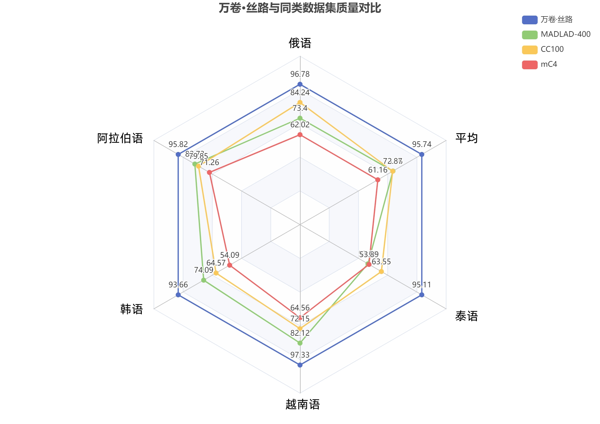
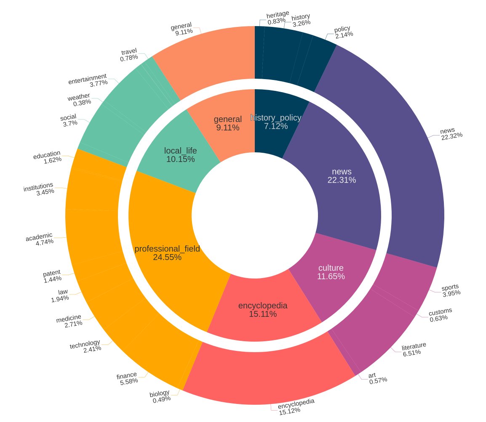

# WanJuan3.0

WanJuanSiLu（“万卷·丝路”）一个作为综合性的纯文本语料库，收集了多个国家地区的网络公开信息、文献、专利等资料，数据总规模超 1.2TB，Token 总数超过 300B（300 billion），处于国际领先水平。首期开源的语料库主要由泰语、俄语、阿拉伯语、韩语和越南语 5 个子集构成，每个子集的数据规模均超过 150GB。

## 下载链接

1. WanJuan-Thai：万卷-丝路（泰语）https://opendatalab.com/OpenDataLab/WanJuan-Thai
2. WanJuan-Russian：万卷-丝路（俄语）https://opendatalab.com/OpenDataLab/WanJuan-Russian
3. WanJuan-Korean：万卷-丝路（韩语）https://opendatalab.com/OpenDataLab/WanJuan-Korean
4. WanJuan-Vietnamese：万卷-丝路（越南语）https://opendatalab.com/OpenDataLab/WanJuan-Vietnamese
5. WanJuan-Arabic：万卷-丝路（阿拉伯语） https://opendatalab.com/OpenDataLab/WanJuan-Arabic

## 数据处理

### 处理流程

为充分体现多语言特色、全面提升数据质量与适用性，我们设计了一套精细化的数据处理流程。该流程有效融合多语言特点与行业通识技术，为多语言模型训练提供了高质量、安全可靠的数据基础。

<div align="center">
    
</div>
<p align="center">
  <b> WanJuanSiLu数据处理流程图 </b>
</p>

1. 数据抽取与格式化
   采用自主研发的文本提取工具从原始网页中抽取核心内容，并规范化为标准的 JSON Lines 格式，然后使用语言检测模型进行语种识别，保留目标语言的数据。
2. 数据清洗与去重
   采用多维度的启发式规则对数据进行系统性清洗，重点解决多类典型噪声问题，并针对多语言语料的特殊性，处理了特定语言中异常噪声等问题。
3. 数据质量
   通过基于困惑度（Perplexity, PPL）进行初步筛选和基于 multilingual-BERT 的质量评分模型，对数据进行两阶段的质量筛选，并通过大模型和语言专家评估数据质量。
4. 数据安全
   建立域名黑名单筛除不良网页数据，构建多语言特色敏感词表并结合语境评估，精准过滤有害内容，同时训练语言安全模型，进行多维度不良内容检测和筛选。
5. 主题分类
   采用 FastText 模型作为核心分类器, 基于多语言数据标签体系，对数据进行主题分类，优化知识域分布。

### 留存分析

我们统计了各个步骤的文档数量，并绘制了各数据处理步骤的相对去除率与绝对留存率，如下图所示。

<div align="center">
    
</div>

## 数据质量

为建立科学的评估体系，我们构建了一个多层级的质量分类框架，将语料问题系统地划分为质量类、重复类和安全类三大维度。质量类问题由于其内在复杂性，进一步细分为相关性、完整性、可理解性、有效性和流畅性五个评估子维度，如下表所示。

<table>
  <tr>
    <th>序号</th>
    <th>一级分类</th>
    <th>二级分类</th>
    <th>定义</th>
  </tr>
  <tr>
    <td>1</td>
    <td rowspan="5">质量类</td>
    <td>完整性</td>
    <td>数据内容是否语义完整</td>
  </tr>
  <tr>
    <td>2</td>
    <td>有效性</td>
    <td>数据内容是否含有效的语义内容</td>
  </tr>
  <tr>
    <td>3</td>
    <td>可理解性</td>
    <td>数据内容是否因格式等错误导致语义有歧义不可理解</td>
  </tr>
  <tr>
    <td>4</td>
    <td>流畅性</td>
    <td>数据内容语义是否流畅</td>
  </tr>
  <tr>
    <td>5</td>
    <td>相关性</td>
    <td>数据是否有上下文主题不相关内容</td>
  </tr>
  <tr>
    <td>6</td>
    <td>重复类</td>
    <td>相似性</td>
    <td>数据是否重复</td>
  </tr>
  <tr>
    <td>7</td>
    <td>安全类</td>
    <td>安全性</td>
    <td>数据是否涉及内容安全</td>
  </tr>
</table>

为了实现多维度的数据质量评估，我们采用了基于大语言模型的开源评估工具 dingo(https://github.com/DataEval/dingo)对语料数据进行综合评分。为了验证清洗后数据的质量水平，我们选取了三个有影响力的多语言公开数据集进行对比分析。

<div align="center">
    
</div>

## 主题分类

基于多语言标签分类体系，我们将每个语料子集细分为 7 个大类和 34 个小类，覆盖历史、政治、文化、房产、购物、天气、餐饮、百科、专业知识等多类具有语言所在地特征内容，便于研究者根据具体需求检索数据，并可适应不同研究领域多样化需求。

<div align="center">
    
</div>

## 许可

WanJuan3.0（万卷·丝路）整体采用 CC BY 4.0 许可协议。您可以自由共享、改编该数据集，唯需遵循以下条件：

署名：您必须适当地标明作者、提供指向本协议的链接，以及指明是否（对原始数据集）做了修改。您可以以任何合理的方式这样做，但不能以任何方式暗示许可人同意您或您的使用。 没有附加限制：您不得使用法律条款或技术措施来限制他人执行许可证允许的任何操作。 完整协议内容，请访问 CC BY 4.0 协议全文。

## 特别注意事项

请注意，本数据集的某些子集可能受制于其他协议规定。在使用特定子集之前，请务必仔细阅读相关协议，确保合规使用。更为详细的协议信息，请在特定子集的相关文档或元数据中查看。

OpenDataLab 作为非盈利机构，倡导和谐友好的开源交流环境，若在开源数据集内发现有侵犯您合法权益的内容，可发送邮件至（OpenDataLab@pjlab.org.cn），邮件中请写明侵权相关事实的详细描述并向我们提供相关的权属证明资料。我们将于 3 个工作日内启动调查处理机制，并采取必要的措施进行处置（如下架相关数据）。但您应确保您投诉的真实性，否则采取措施后所产生的不利后果应由您独立承担。

## 引文
```
@misc{yu2025wanjuansiluhighqualityopensourcewebtext,
      title={WanJuanSiLu: A High-Quality Open-Source Webtext Dataset for Low-Resource Languages},
      author={Jia Yu and Fei Yuan and Rui Min and Jing Yu and Pei Chu and Jiayang Li and Wei Li and Ruijie Zhang and Zhenxiang Li and Zhifei Ren and Dong Zheng and Wenjian Zhang and Yan Teng and Lingyu Meng and ZhenJiang Jin and Jiantao Qiu and ShaSha Wang and Zhongying Tu and Dahua Lin and Yu Wang and Yu Qiao and Yanfeng Wang and Conghui He},
      year={2025},
      eprint={2501.14506},
      archivePrefix={arXiv},
      primaryClass={cs.CL},
      url={https://arxiv.org/abs/2501.14506},
}
```
